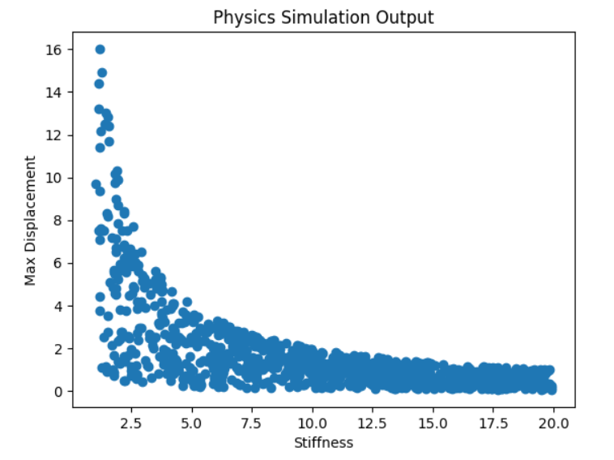
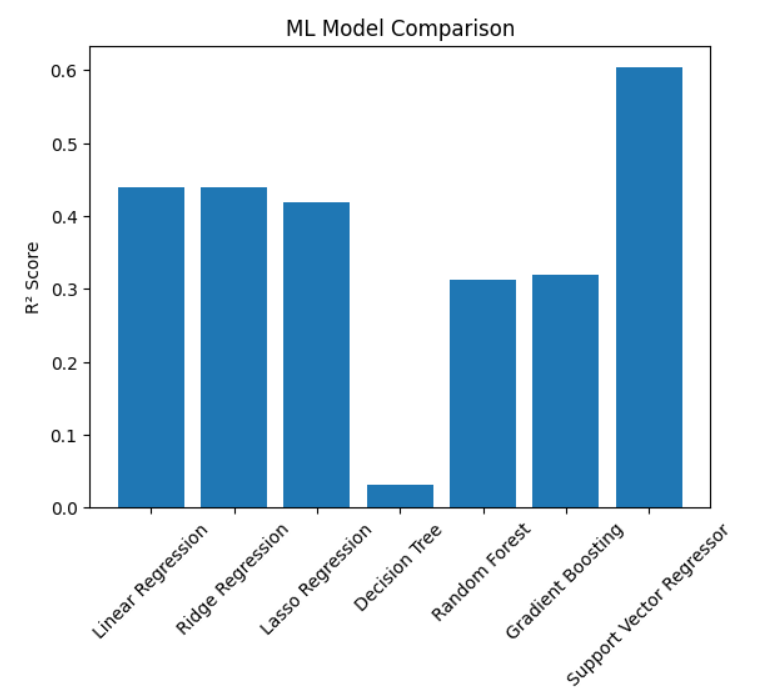

# Data Generation using Modelling and Simulation for Machine Learning

## Assignment Overview
This project demonstrates the use of modelling and simulation techniques to generate synthetic data for machine learning applications. A physical mass–spring–damper system was simulated to generate data, which was then used to train and evaluate multiple machine learning models.

The objective is to:
- Generate data using a simulation model
- Train multiple ML models on the generated data
- Compare model performance using standard evaluation metrics
- Identify the best-performing model

---

## Step 1: Simulation Tool Selection

**Simulation Tool Used:**  
Python (NumPy, SciPy, Matplotlib)

Python was chosen due to its strong support for numerical computation, simulation, and machine learning. The simulation represents a classical mechanical system (mass–spring–damper), commonly used in physics and engineering.

---

## Step 2: Simulator Installation and Exploration

The following Python libraries were installed and used:
- NumPy
- Pandas
- Matplotlib
- Scikit-learn

The simulator computes the system response based on randomly generated physical parameters and records the maximum displacement of the system.

---

## Step 3: Parameter Selection and Bounds

The important parameters affecting system behavior were identified. Their lower and upper bounds were selected based on realistic physical values and numerical stability.

| Parameter | Lower Bound | Upper Bound | Description |
|---------|-------------|-------------|-------------|
| Mass (m) | 0.5 kg | 5.0 kg | Mass of the object |
| Damping (c) | 0.1 Ns/m | 2.0 Ns/m | Damping coefficient |
| Stiffness (k) | 1 N/m | 20 N/m | Spring stiffness |
| Force (F) | 1 N | 10 N | External applied force |

The bounds ensure sufficient variability in system behavior for machine learning.

### Effect of Parameter Bounds
The following figure shows the relationship between stiffness and maximum displacement across the defined bounds:

---

## Step 4: Data Generation using Simulation

Random values for each parameter were generated uniformly within the defined bounds. These values were passed into the simulator, and the resulting maximum displacement was recorded.

A total of **1000 simulations** were generated.

The final dataset was stored in CSV format:

- **File:** `simulationData.csv`
- **Columns:** Mass, Damping, Stiffness, Force, Max Displacement

---

## Step 5: Machine Learning Model Training

The generated dataset was used to train multiple regression models. The target variable was **Maximum Displacement**, and the input features were the physical parameters.

### Machine Learning Models Used
- Linear Regression
- Ridge Regression
- Lasso Regression
- Decision Tree Regressor
- Random Forest Regressor
- Gradient Boosting Regressor
- Support Vector Regressor (SVR)

---

## Step 6: Model Comparison and Evaluation

Models were evaluated using the following metrics:
- Mean Absolute Error (MAE)
- Mean Squared Error (MSE)
- Root Mean Squared Error (RMSE)
- R² Score

### Model Performance Comparison

| Model | MAE | MSE | RMSE | R² Score |
|------|-----|-----|------|---------|
| Linear Regression | 1.0399 | 2.5177 | 1.5867 | 0.3590 |
| Ridge Regression | 1.0399 | 2.5177 | 1.5867 | 0.3590 |
| Lasso Regression | 0.9936 | 2.5044 | 1.5825 | 0.3624 |
| Decision Tree | 0.9816 | 2.0936 | 1.4469 | 0.4670 |
| Random Forest | 0.8036 | 1.4906 | 1.2209 | 0.6205 |
| Gradient Boosting | 0.7965 | 1.3859 | 1.1773 | **0.6472** |
| Support Vector Regressor | 0.7969 | 1.7877 | 1.3370 | 0.5449 |

### Model Comparison Graph

---

## Results and Observations

- Linear models performed poorly due to the non-linear nature of the simulation data.
- Tree-based ensemble models significantly outperformed linear models.
- **Gradient Boosting Regressor** achieved the best performance with the highest R² score and lowest error values.

---

## Conclusion

This project successfully demonstrates how modelling and simulation can be used to generate synthetic datasets for machine learning. The results show that non-linear machine learning models are better suited for capturing complex relationships in simulated physical systems.

---

